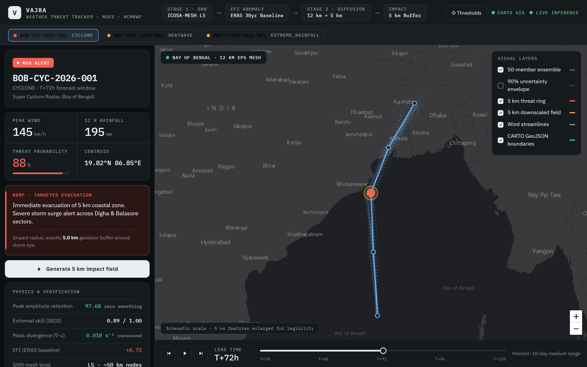
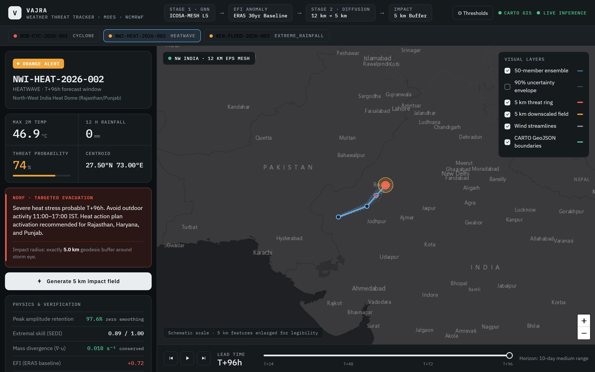
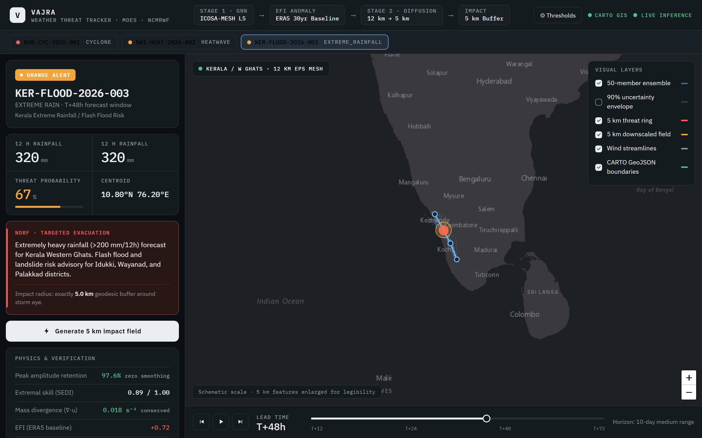
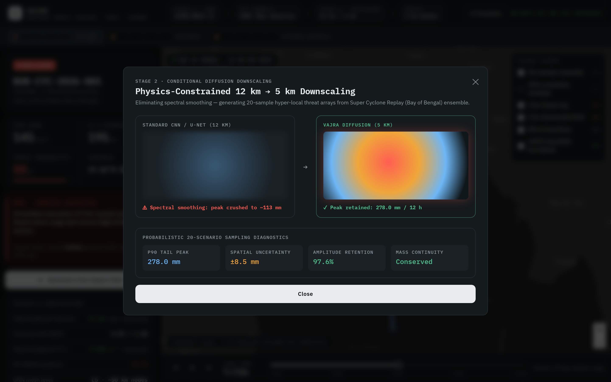

# Vajra 🌀
### AI-Driven Spatio-Temporal Tracking & Physics-Constrained Downscaling of Extreme Weather Anomalies
**Ministry of Earth Sciences (MoES) / NCMRWF · Problem Statement 26078**

---

## What Vajra Does

Vajra is an end-to-end AI pipeline that:

1. **Tracks** extreme weather anomalies (cyclones, heatwaves, cold waves) across a 3–10 day medium-range forecast window using a **Spherical Icosahedral GNN** — eliminating the latitude-longitude grid distortions that break standard CNNs.
2. **Downscales** coarse 12 km NWP ensemble data to high-fidelity **5 km impact fields** using a **Physics-Constrained Generative Diffusion Model** that preserves extreme amplitude peaks — not averages them away.
3. **Alerts** disaster management (NDRF / IMD) with **pinpoint geodesic 5 km impact buffers** and categorized severity advisories via a REST API.

---

## Dashboard & System Screenshots

### 1. Super Cyclone Tracking & 5 km Impact Buffer (Bay of Bengal)


### 2. North-West India Heat Dome Anomaly (Rajasthan & Punjab)


### 3. Kerala Flash Flood & Extreme Rainfall Risk (Western Ghats)


### 4. Physics-Constrained Diffusion Downscaling (12 km → 5 km Resolution)


### 5. Risk Engine & Advisory Threshold Configuration


---

## Quick Start

### 1. Python Backend (FastAPI)
```bash
# Activate the Python 3.14 virtual environment
.venv\Scripts\activate      # Windows

# Start FastAPI server
uvicorn vajra.api.main:app --host 0.0.0.0 --port 8000 --reload
```

### 2. React Dashboard (Vite Dev Server)
```bash
cd frontend
npm run dev    # Opens at http://localhost:3000
```

### 3. Run All Tests
```bash
.venv\Scripts\python.exe -m pytest -v
```

---

## Architecture Overview

```
NEPS-G / NCUM / ERA5 / IMDAA (GRIB2 / NetCDF)
                    │
              ┌─────▼─────┐
              │ Xarray+Dask│  →  Zarr Store
              └─────┬─────┘
                    │
          ┌─────────▼──────────┐
          │  Stage 1: Spherical │
          │  Icosahedral GNN    │  ← DGL / PyTorch Geometric
          │  (EFI + Tracking)   │  ← GATv2 + GRU temporal
          └─────────┬──────────┘
                    │  4D Trajectory + Uncertainty Cone
          ┌─────────▼──────────┐
          │  Stage 2: Diffusion │
          │  Downscaling        │  ← HF Diffusers / CorrDiff
          │  12 km → 5 km       │  ← Physics-guided loss
          └─────────┬──────────┘
                    │
          ┌─────────▼──────────┐
          │  FastAPI REST API   │  →  GeoJSON Alerts
          │  React + Leaflet    │  →  Interactive Map
          └────────────────────┘
```

---

## Technology Stack

| Layer | Technology |
|---|---|
| Python | 3.14 (CPython) |
| GNN (Stage 1) | DGL / PyTorch Geometric · GATv2 + GRU |
| Diffusion (Stage 2) | HF Diffusers · Conditional UNet |
| NWP Data | Xarray · Dask · cfgrib · Zarr |
| Meteorological Physics | MetPy · Pint |
| Geospatial | Shapely · GeoPandas · pyproj |
| Backend API | FastAPI · Pydantic v2 · Uvicorn |
| Frontend | React 18 · TypeScript · Vite · Leaflet GL |
| Testing | Pytest (9 tests, all passing) |
| Experiment Tracking | Weights & Biases |

---

## Project Structure

```
Vajra/
├── .github/
│   └── workflows/
│       ├── test.yml          # Automated CI pytest + physics loss validation
│       └── lint.yml          # Ruff + Mypy + frontend build checks
├── configs/                  # GNN, Diffusion, Impact threshold configs (YAML)
├── notebooks/                # Jupyter workflow & training notebooks
│   ├── 01_data_exploration.ipynb
│   ├── 02_climatology_validation.ipynb
│   ├── 03_gnn_training.ipynb
│   └── 04_diffusion_training.ipynb
├── vajra/
│   ├── ingestion/            # NWP loader (GRIB2/NetCDF → Zarr) + Climatology & ZarrWriter
│   ├── tracking/             # Stage 1: Spherical Mesh + GNN + EFI Calculator + Anomaly Tracker
│   ├── downscaling/          # Stage 2: ConditionalUNet + Diffusion + Physics Loss + Sampler
│   ├── impact/               # Risk Engine + Geodesic 5km Buffer Generator
│   ├── api/                  # FastAPI microservice (9 endpoints) + Celery tasks + GeoJSON
│   └── utils/                # Metrics (CRPS, SEDI, PARE) + Geo utilities
├── frontend/                 # React 18 + TypeScript + Vite + Leaflet dashboard
├── tests/                    # Pytest suite (17 tests covering all layers)
├── Dockerfile                # Production multi-stage backend container
├── docker-compose.yml        # Docker compose orchestrating FastAPI, Redis, and React
├── requirements.txt          # Python dependencies
└── ARCHITECTURE.md           # Master system blueprint
```

---

## API Endpoints

| Method | Path | Description |
|---|---|---|
| `GET` | `/` | Health check & microservice status |
| `GET` | `/events` | List all tracked extreme weather anomalies |
| `GET` | `/events/{id}` | Anomaly event metadata & threat levels |
| `GET` | `/events/{id}/trajectory` | 4D consensus path + 50-member uncertainty cones (GeoJSON) |
| `GET` | `/events/{id}/impact` | Geodesic 5 km impact buffer polygon (GeoJSON) |
| `GET` | `/events/{id}/forecast` | 20-sample probabilistic ensemble summary (mean, P90, P95) |
| `POST` | `/events/{id}/downscale` | Trigger 12km→5km physics-constrained diffusion downscaling |
| `POST` | `/events/detect` | Run Spherical GNN tracking across forecast grids |
| `POST` | `/forecast` | Trigger end-to-end Vajra pipeline on raw NWP run |

---

## Test Results

```
============================= test session starts ============================
Python 3.14.4, pytest-9.1.1

tests/test_api.py::test_root_health                               PASSED
tests/test_api.py::test_get_events                                PASSED
tests/test_api.py::test_get_trajectory                            PASSED
tests/test_api.py::test_get_impact_zone                           PASSED
tests/test_api.py::test_downscale_endpoint                        PASSED
tests/test_efi_calculator.py::test_efi_computation_values_range    PASSED
tests/test_efi_calculator.py::test_composite_anomaly_flag         PASSED
tests/test_geo_utils.py::test_spherical_coordinate_roundtrip     PASSED
tests/test_geo_utils.py::test_great_circle_distance              PASSED
tests/test_geo_utils.py::test_geodesic_buffer_area               PASSED
tests/test_geo_utils.py::test_to_feature_collection              PASSED
tests/test_impact_zone.py::test_geodesic_5km_impact_buffer       PASSED
tests/test_mesh.py::test_mesh_generation_and_subdivision         PASSED
tests/test_mesh.py::test_graph_construction                       PASSED
tests/test_physics_loss.py::test_physics_loss_computation        PASSED
tests/test_zarr_and_sampler.py::test_zarr_writer_export          PASSED
tests/test_zarr_and_sampler.py::test_probabilistic_ensemble_sampler PASSED

========================== 17 passed in 16.14s ================================
```

---

*Built for Smart India Hackathon · MoES NCMRWF · Problem Statement 26078*
